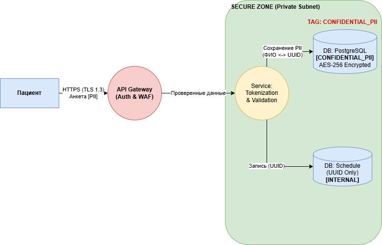
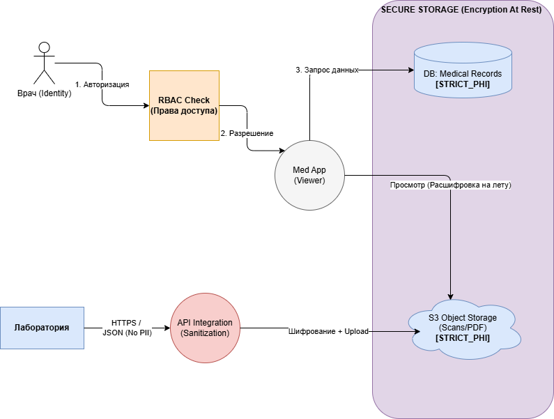
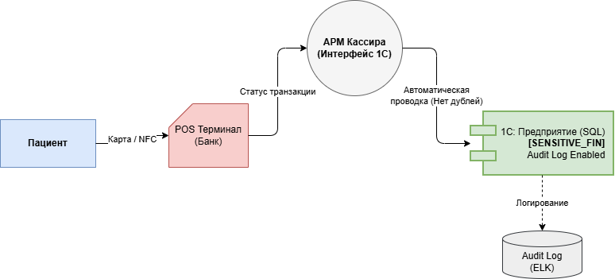

# Проектирование защищенной архитектуры данных (TO-BE)

Ниже представлено решение задачи по обеспечению безопасности данных компании «Медикаменте», 
включая классификацию, механизмы тегирования и обновленные диаграммы потоков данных.

---

## 1. Список данных и способы защиты

На основе анализа текущих процессов и требований безопасности (152-ФЗ), данные разделены на категории с соответствующими методами защиты.

| Категория данных | Примеры | Способы защиты |
| :--- | :--- | :--- |
| **PII** (Персональные данные) | ФИО, Паспорт, Адрес, Телефон, Email | • **Шифрование (At Rest):** AES-256 в базе данных (pgcrypto). • **Шифрование (In Transit):** TLS 1.3 при передаче. • **Обезличивание:** Замена ФИО на `Patient_UUID` для всех систем, кроме CRM. • **Маскирование:** Скрытие части данных (например, `+7 *** *** 45-12`) для операторов. |
| **PHI** (Врачебная тайна) | Диагнозы, Заключения, История болезни, Сканы, Анализы | • **Строгое шифрование:** Хранение в зашифрованном Object Storage (S3 SSE). • **Управление доступом (ABAC/RBAC):** Доступ только у лечащего врача. • **Data Minimization:** Лаборатория передает только ID биоматериала, а не ФИО пациента. |
| **FIN** (Финансовые данные) | Сумма оплаты, данные чека, статус транзакции | • **RBAC:** Доступ только у ролей «Бухгалтер» и «Кассир». • **Audit Log:** Логирование всех изменений финансовых записей (защита от махинаций). • **Исключение:** Не хранить полные данные карт (использовать токены платежного шлюза). |
| **System** (Служебные данные) | Логины, пароли сотрудников, API-ключи | • **Хеширование:** bcrypt/Argon2 для паролей. • **Secrets Management:** Хранение ключей в Vault, запрет на хардкод в конфигурациях. |

---

## 2. Механизм тегирования данных

Для реализации автоматического контроля доступа и DLP (Data Loss Prevention) предлагается использовать **Apache Atlas** (или аналог) для управления метаданными.

**Система тегов:**

1.  **`CONFIDENTIAL_PII`**
    * *Правило:* Доступ разрешен только ролям `ADMINISTRATOR` (для техподдержки) и `DOCTOR` (в режиме просмотра карты).
    * *Действие:* При выгрузке в аналитику данные автоматически хешируются.
2.  **`STRICT_PHI`**
    * *Правило:* Доступ только роли `DOCTOR` (только к *своим* пациентам) и `PATIENT` (к своим данным через ЛК).
    * *Действие:* Обязательное шифрование на диске. Блокировка отправки по email без шифрования.
3.  **`SENSITIVE_FIN`**
    * *Правило:* Доступ ролям `ACCOUNTANT`, `CASHIER`.
    * *Действие:* Запрет на редактирование «задним числом» без записи в журнал аудита.
4.  **`INTERNAL_PUBLIC`**
    * *Правило:* Расписание работы клиники, список услуг.
    * *Действие:* Доступен всем сотрудникам внутри сети.

---

## 3. Инструменты и меры безопасности (Security Controls)

Для обеспечения конфиденциальности в потоках данных (Data Flows) внедряется следующий стек:

### Сетевая безопасность (Network Security)
* **Reverse Proxy (Nginx / Traefik):** Терминация SSL/TLS, защита от базовых DDoS-атак.
* **VPN (OpenVPN / WireGuard):** Для безопасного доступа администраторов и удаленных сотрудников (вместо RDP).

### Аутентификация и Авторизация (IAM)
* **Keycloak:** Реализация единой точки входа (SSO) и управления ролями (RBAC). Заменяет разрозненные учетные записи в 1С и Windows.

### Защита данных (Data Protection)
* **PostgreSQL + pgcrypto:** Хранение PII в структурированном виде с шифрованием на уровне колонок.
* **MinIO (S3 compatible):** Объектное хранилище для сканов и PDF с включенным Server-Side Encryption (SSE). Заменяет файловые папки Windows.
* **HashiCorp Vault:** Управление секретами и ключами шифрования.

### Мониторинг и Аудит (SIEM)
* **ELK Stack (Elasticsearch, Logstash, Kibana):** Централизованный сбор логов доступа. Настройка алертов на аномальную активность (например, массовая выгрузка карт).

---

## 4. Обновленные диаграммы потоков данных (TO-BE)

 В целевом состоянии (TO-BE) устранены уязвимости AS-IS: Excel заменен на БД, файловый сервер — на S3, внедрено шифрование.

* **Диаграмма**: Регистрация пациента (TO-BE)
* **Изменения**: Excel заменен на БД Postgres. Добавлен сервис токенизации. Каналы защищены TLS. Данные тегированы.
* * 
#####
* **Диаграмма**: Медицинское обслуживание (TO-BE)
* **Изменения**: Файловый сервер заменен на S3 Storage с шифрованием. Добавлен контроль доступа (RBAC) перед просмотром данных.
* 
#####
* **Диаграмма**: Оплата (TO-BE)
* **Изменения**: Убран двойной ввод. Данные идут от Кассира сразу в 1С (SQL) через интерфейс.
*  