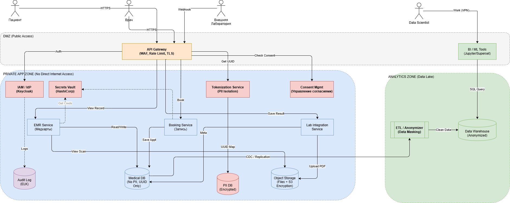

# Архитектура Privacy by Design (PbD) для «Медикаменте»

Для реализации подхода **Privacy by Design (PbD)** в архитектуре «Медикаменте» необходимо перейти от реактивной защиты (исправление утечек) к проактивной (архитектурная невозможность утечек).

---

## Новые архитектурные блоки для Privacy by Design

Чтобы система соответствовала принципам PbD, необходимо внедрить специализированные компоненты, которые забирают на себя функции защиты данных от бизнес-сервисов.

### Сервис Идентификации и Управления Доступом (IAM / IdP)
* **Зачем нужен:** Централизованное управление пользователями (пациенты, врачи, администраторы). Реализует принцип **«Privacy as Default»**.
* **Функции:** Single Sign-On (SSO), многофакторная аутентификация (MFA), хранение учетных записей.
* **Технология:** Keycloak 

### Сервис Токенизации (PII Vault)
* **Зачем нужен:** Реализует принцип **«Псевдонимизации»**. Бизнес-сервисы (запись к врачу, анализы) не должны знать ФИО пациента, они должны работать только с обезличенным `User_UUID`.
* **Функции:** Принимает PII (ФИО, паспорт), сохраняет их в изолированную БД, возвращает токен (UUID). Осуществляет обратное преобразование только для авторизованных запросов.

### Сервис Управления Согласиями (Consent Management)
* **Зачем нужен:** Реализует принцип **«Уважение к приватности пользователя»**.
* **Функции:** Хранит детальные настройки: разрешил ли пациент SMS-рассылку? Разрешил ли передачу данных в страховую? Разрешил ли использование данных для обучения AI?
* **Логика:** Любой сервис перед обработкой данных опрашивает этот блок.

### Сервис Аудита (Audit Log Service)
* **Зачем нужен:** Реализует принцип «Прозрачность и Видимость».
* **Функции:** Неизменяемое (append-only) хранилище логов доступа. Фиксирует, кто, когда и зачем запросил расшифровку данных пациента.

### Хранилище Секретов (Secrets Vault)
* **Зачем нужен:** Реализует принцип «End-to-End Security».
* **Функции:** Хранит ключи шифрования БД, сертификаты SSL и пароли сервисов. Ключи никогда не хранятся в коде или конфигурационных файлах.
* **Технология:** HashiCorp Vault.

---

## Аналитический слой (Data Analytics Layer)

В задании указано требование создать озеро данных для BI и ML. Согласно PbD, аналитики и Data Scientists не должны иметь доступа к «сырым» данным.

Предлагаемая архитектура аналитического слоя:

1.  **ETL-Анонимайзер (Data Masking Pipeline):**
    * Промежуточный слой между продуктовыми БД и аналитическим хранилищем.
    * **Функция:** «На лету» заменяет ФИО на хеши, обрезает точные даты рождения до года, удаляет телефоны.
2.  **Аналитическое Хранилище (DWH / Data Lake):**
    * Содержит только обезличенные данные.
    * Разделено на зоны:
        * Доступ только у автоматических скриптов.
        * Данные очищены от PII. Доступ для Data Scientists.
        * Отчеты. Доступ для менеджмента.
3.  **ML Sandbox:**
    * Изолированная среда, куда попадают только синтетические или глубоко обезличенные данные для обучения моделей.

---

## Диаграмма C4 Container (TO-BE)

 На схеме **Красным** выделены новые блоки безопасности, **Зеленым** — аналитический слой.
#####
 

